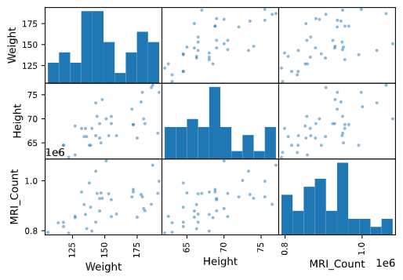

```{r setup, include = FALSE}
knitr::opts_chunk$set(echo = TRUE)
library(webex)
library(tidyverse)
tutorial::go_interactive()
```


<iframe src="https://docs.google.com/forms/d/e/1FAIpQLSdbB7Mb2eFDFfzY1uWWX-dD2LAL11ItY9DIdqoATzisBaBjFQ/viewform?embedded=true" width="1000" height="640" frameborder="0" marginheight="0" marginwidth="0">Loading...</iframe>


# SQL Query 40%

Prepare SQL Script to calculate transition matrix with data from [this link](https://docs.google.com/spreadsheets/d/1vVGJziFmCnpS6-ePgc6ZpjVlPLrX9QMo_8gBJTeNy-k/edit?usp=sharing) as per below template.

- Roll back: Loans that have DPD group lower than started with (e.g. Loans that are in B1 as of 201906 and move back to B0 as of 201907)
- Stabilize: Loans that have DPD group that is the same as started with (e.g. Loans that are in B1 as of 201906 and stay the same as B1 as of 201907)
- Roll forward: Loans that have DPD group higher than started with (e.g. Loans that are in B1 as of 201906 and move to B2 as of 201907)

```{r, echo = FALSE}
cat(
'Month  | DPDGroup | Roll back	| Stabilize |	Roll forward|
201906 |   B0	 |              |	    97% |         	3%  |
201906 |   B1	 |              |           |	          	|
201906 |   B2	 |              |           |	          	|
201906 |   B3	 |              |           |	          	|')
```

```{python ex="create_b5", type="sample-code"}
# You can type SQL here, please do not run it
```


# Statistical thinking 20%

## Question 1: Probability thinking 

Defaulting on a loan means failing to pay it back on time. The default rate among VIB clients on their personal loans is 1%. As a project you develop a test to predict which client will default. Your test is good but not perfect. It gives 4% false positives, i.e. predicting a customer will default who in fact will not. If has a 0% false negative rate, i.e. predicting a customer won’t default who in fact will.

1. Suppose a random customer tests positive. What is the probability that he will truly default? `r fitb("0.202")`

2. Suppose your boss offers to bet you the customer in part (1) won’t default. He wants you to pay him \$100 if the customer doesn’t default and he’ll pay you \$400 if the customer does default. Is this a good bet for you to take? `r mcq(c(answer = "Yes", "No"))`

## Question 2: Simulation 

Data is collected on the time between arrivals of customers at a branch of VIB. We collect a data set of size 45 with sample mean $\bar{x}$ = 5.0 and sample standard deviation $s$ = 4.0. By bootstrapping, we generate 500 values for the differences $\delta^* = \bar{x}^* - \bar{x}$. The smallest and largest 150 are written in non-decreasing order in `smallest` and `largest` variables. Use this data to find an 80\% bootstrap confidence interval for $\mu$.

Lower bound: `r fitb("4.831")`. Higher bound: `r fitb("5.200")`

```{r ex="create_a", type="pre-exercise-code"}
smallest <- c(-0.534, -0.494, -0.491, -0.485, -0.422, -0.403, -0.382, -0.365, -0.347, -0.336, -0.330, -0.328, -0.315,
              -0.304, -0.297, -0.293, -0.287, -0.279, -0.273, -0.273, -0.271, -0.269, -0.262, -0.262, -0.260, -0.257,
              -0.256, -0.255, -0.249, -0.248, -0.241, -0.240, -0.232, -0.226, -0.225, -0.223, -0.222, -0.220, -0.216,
              -0.216, -0.213, -0.211, -0.211, -0.210, -0.209, -0.209, -0.208, -0.204, -0.202, -0.200, -0.200, -0.200,
              -0.195, -0.193, -0.192, -0.192, -0.189, -0.188, -0.188, -0.183, -0.182, -0.182, -0.181, -0.179, -0.179,
              -0.178, -0.176, -0.175, -0.174, -0.170, -0.170, -0.166, -0.164, -0.163, -0.163, -0.162, -0.162, -0.160,
              -0.160, -0.159, -0.159, -0.159, -0.158, -0.157, -0.156, -0.156, -0.155, -0.155, -0.154, -0.154, -0.153,
              -0.152, -0.151, -0.151, -0.150, -0.148, -0.148, -0.146, -0.145, -0.145, -0.144, -0.142, -0.142, -0.142,
              -0.138, -0.137, -0.135, -0.135, -0.134, -0.134, -0.133, -0.131, -0.129, -0.128, -0.124, -0.124, -0.124,
              -0.123, -0.123, -0.119, -0.118, -0.114, -0.114, -0.114, -0.112, -0.111, -0.109, -0.108, -0.108, -0.107,
              -0.105, -0.103, -0.103, -0.103, -0.102, -0.101, -0.099, -0.098, -0.098, -0.097, -0.097, -0.096, -0.095,
              -0.095, -0.095, -0.093, -0.093, -0.093, -0.093, -0.093)
largest <- c(0.073, 0.074, 0.075, 0.075, 0.077, 0.077, 0.077, 0.077, 0.079, 0.087, 0.094, 0.104, 0.11, 0.118, 0.134,
             0.143, 0.156, 0.17, 0.182, 0.22, 0.243, 0.274, 0.079, 0.08, 0.087, 0.088, 0.094, 0.096, 0.104, 0.106,
             0.111, 0.112, 0.122, 0.122, 0.135, 0.136, 0.145, 0.146, 0.162, 0.163, 0.172, 0.172, 0.186, 0.195, 0.22, 
             0.221, 0.244, 0.245, 0.288, 0.288, 0.081, 0.081, 0.082, 0.083, 0.084, 0.091, 0.091, 0.091, 0.092, 0.092,
             0.097, 0.1, 0.1, 0.101, 0.101, 0.106, 0.108, 0.108, 0.108, 0.108, 0.112, 0.112, 0.112, 0.113, 0.114, 0.123,
            0.127, 0.129, 0.129, 0.132, 0.136, 0.137, 0.14, 0.141, 0.142, 0.147, 0.147, 0.148, 0.151, 0.151, 0.164,
            0.164, 0.165, 0.166, 0.168, 0.175, 0.178, 0.179, 0.18, 0.181, 0.202, 0.202, 0.205, 0.206, 0.21, 0.222,
            0.224, 0.225, 0.232, 0.232, 0.251, 0.253, 0.258, 0.261, 0.263, 0.291, 0.307, 0.312, 0.314, 0.316, 0.078,
            0.079, 0.085, 0.085, 0.093, 0.093, 0.102, 0.103, 0.108, 0.11, 0.114, 0.115, 0.134, 0.134, 0.142, 0.143, 0.154,
            0.155, 0.169, 0.169, 0.182, 0.182, 0.216, 0.219, 0.236, 0.236, 0.266, 0.273, 0.348, 0.488)
```

```{r ex="create_a", type="sample-code"}
head(smallest)
head(largest)
```

# Statistical programming: Python 20%

1. Given the following dataset, write a function `hmean` to calculate the harmonic mean.

```{python ex ="create_b2", type="pre-exercise-code"}
x = [8.0, 1, 2.5, 4, 28.0]
```

```{python ex="create_b2", type="sample-code"}
print(x)
def hmean():
  # Your code here
  pass

print(hmean(x))
```

2. The `data` variable contains the information of Brain size. We have imported `pandas` as `pd` and `numpy` as `np` already for you.

```{python ex ="create_b3", type="pre-exercise-code"}
import pandas as pd
import numpy as np
data = pd.read_csv('https://scipy-lectures.org/_downloads/brain_size.csv', sep=';', na_values=".")
data['Gender'] = np.where(data['Gender'] == 'Female', 1, 0)
```

```{python ex="create_b3", type="sample-code"}
print(data)
```

Please reproduce the following image.



3. The IQ metrics are unimodal. `r torf(FALSE)`
4. In linear algebra, we use matrix operators to compute beta matrix for multiple linear regression. With pandas and numpy only, return the list of beta.

```{python ex ="create_b4", type="pre-exercise-code"}
import pandas as pd
import numpy as np
data = pd.read_csv('https://scipy-lectures.org/_downloads/brain_size.csv', sep=';', na_values=".")
data['Gender'] = np.where(data['Gender'] == 'Female', 1, 0)
```

```{python ex="create_b4", type="sample-code"}
print(data)
print(beta) #<--- your result should be here
```

List of beta: `r fitb("[-26747.0380472  -10794.88612326   6346.46347607   7022.04650577   53.33537297   9424.86608455]")`

# Machine learning 20%

From following pseudo code of k-nearest neighbors for classification, please convert it into Python code. Using only `numpy` as `np`.

```{python, echo = TRUE, eval = FALSE}
for everyPoint in dataSet:
  Calculate distance between observation X and the current point
  Sort the distances in increasing order
  Take k items with lowest distances to observation X
  Find the majority class among these items
  Return the majority class as our prediction for the class of observation X
```

```{python ex="create_b6", type="pre-exercise-code"}
import numpy as np
```

```{python ex="create_b6", type="sample-code"}

def kNN(obX, dataSet, labels, k):
  # Your code here
  pass

# You can test with following dataset

def createDataSet():
    group = np.array([[1.0,1.1],
                    [1.0,1.0],
                    [0,0],
                    [0,0.1]])
    labels = ['A','A','B','B']
    return group, labels
dataSet, labels = createDataSet()
print(kNN([0,0], dataSet, labels, k = 3))
```

